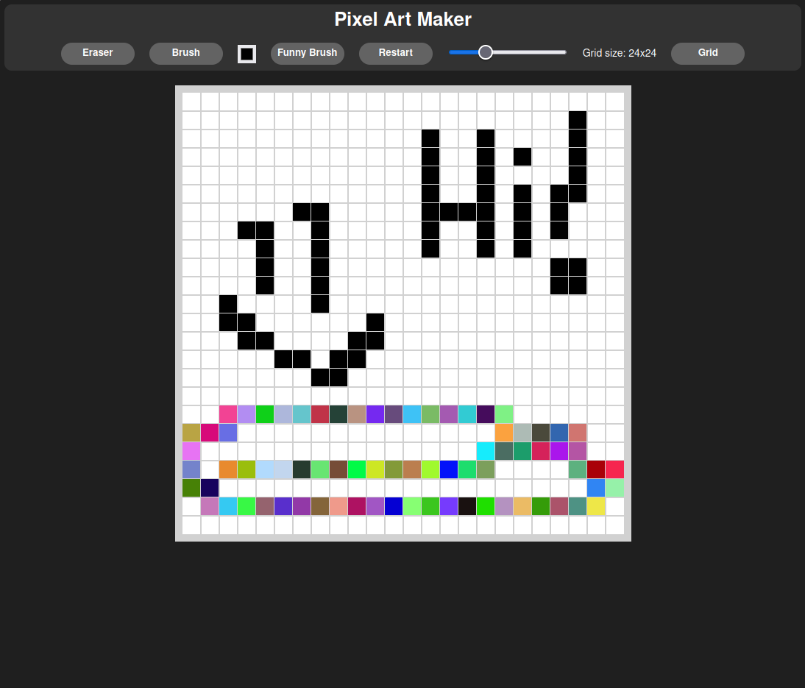

# Etch-A-Sketch

Interactive browser drawing application inspired by the classic Etch-A-Sketch toy.

This project focuses on DOM manipulation, dynamic grid generation and user interaction using vanilla JavaScript without external frameworks.

## Features

- Dynamic drawing grid
- Adjustable grid size
- Mouse interaction drawing
- Color changing functionality
- Grid reset system
- Responsive layout
- Pure JavaScript implementation

## Tech Stack

- HTML
- CSS
- JavaScript

## Live preview
https://bachatron.github.io/etch-a-sketch/

## Installation

Clone the repository:

```bash
git clone https://github.com/bachatron/etch-a-sketch.git
cd etch-a-sketch
```

Open `index.html` in your browser.

## Concepts Practiced

- DOM manipulation
- Event listeners
- Dynamic element generation
- CSS grid layout
- User interaction handling

## Future Improvements

- Touch support
- Export drawings
- Color picker
- Drawing modes
- Improved mobile experience

## Screenshot

<p align="center">
  
</p>

## Author

bachatron
